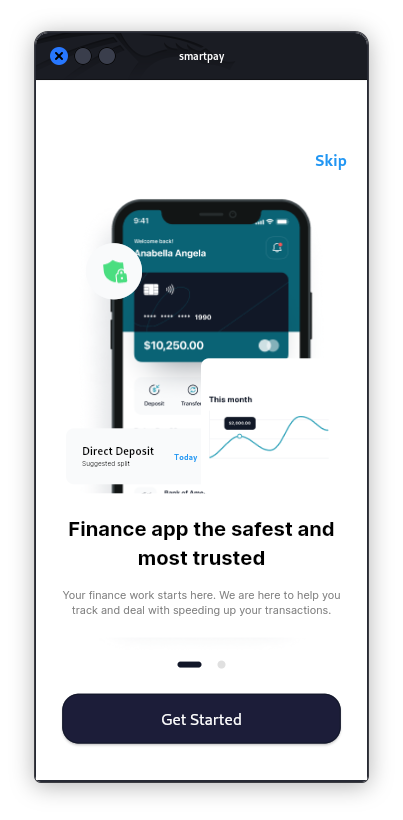
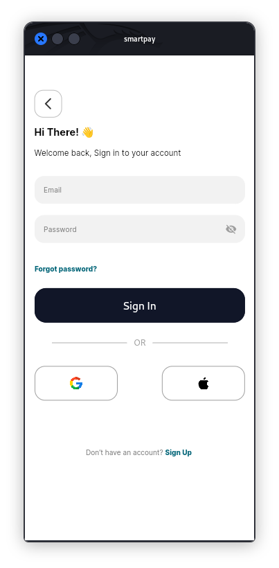
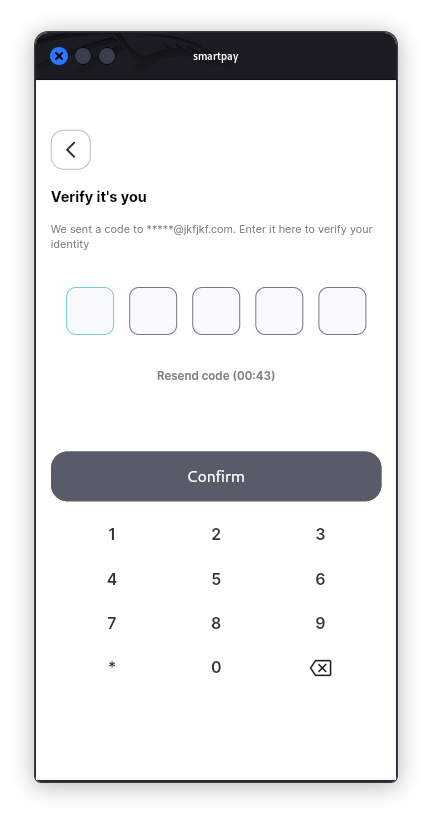
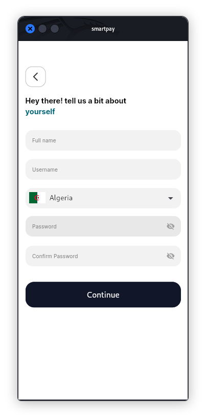
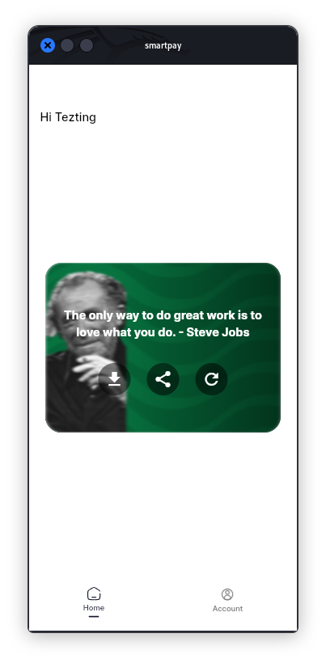
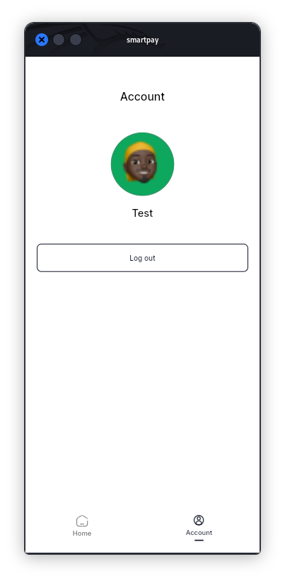

# smartpay

This Finance App is a powerful mobile application tailored for fastest and most trusted transactions to pay all your bills with just a few steps. Paying your bills become fast and efficient. Developed using Flutter, this app provides a unified, cross-platform solution with an elegant and intuitive interface.

## Tools used in building

- flutter `v3.19.5 - mobile sdk`
- stacked `state management`
- flutter_hooks `internal state`
- iconsax `icon pack`
- animations `flutter animations package`
- flutter_animate `gskinner animations package` etc

## App screenshots
<table>
  <tr>
    <td align="center">
      
      
Onboarding

    </td>
    <td align="center">
      
      
Signup

    </td>
    <td align="center">
      
      
OTP

    </td>
    </tr>
    <tr>
    <td align="center">
      
      
Signup form

    </td>
    <td align="center">
      
      
Home

    </td>
    <td align="center">
      
      
Account

    </td>
  </tr>
</table>
